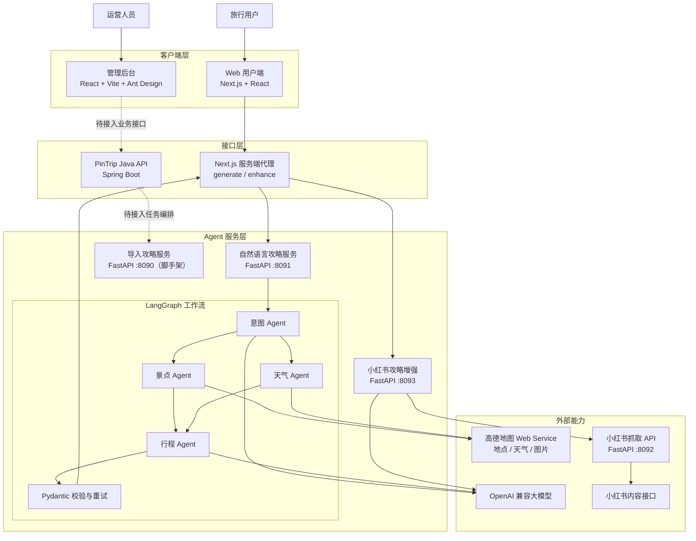
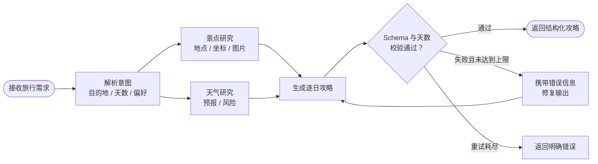

# PinTrip（拾途）

PinTrip 是一个 AI 旅行攻略生成平台。用户可以用自然语言描述目的地、旅行天数、交通方式和兴趣偏好，系统通过多 Agent 协作完成需求解析、景点与天气研究，并生成包含每日行程、预算和实景图片的结构化攻略。

项目同时包含 Java API、管理后台和两个职责独立的攻略 Agent，为后续扩展数据来源和攻略生成能力预留了清晰边界。

## 核心功能

### 自然语言生成攻略

- 支持输入“国庆去格聂玩 5 天，从成都出发”等自然语言需求。
- 意图 Agent 提取目的地、天数、交通、住宿、旅行偏好和额外约束。
- 未提供天数、交通或住宿时使用合理默认值。
- 结构化调用方可以直接传入目的地等字段，跳过意图 LLM。

### 多 Agent 协同研究

- 景点 Agent：调用高德地图检索真实地点、地址、坐标和实景图片。
- 天气 Agent：解析城市行政区编码并查询天气预报和旅行风险。
- 行程 Agent：综合用户需求、景点和天气信息，生成逐日攻略。
- LangGraph：管理共享状态、并行研究、结果汇合、校验和失败重试。

### 结构化攻略展示

- 按天展示时间、地点、活动和交通安排。
- 优先使用高德 POI 返回的真实图片作为每日封面，不编造图片地址。
- 输出标题、摘要、预算、风险提示和来源笔记 ID。
- 自动隐藏“数据缺失”“待生成”“警示版”等不适合展示给用户的占位内容。

## 整体系统架构



实线表示当前已经接通的主要调用链路，虚线表示已建立模块但尚未完成的业务集成。

## 自然语言 Agent 调用流程



景点研究和天气研究由 LangGraph 异步并行执行，直接返回标准化高德数据，不再分别调用大模型。两个节点都完成后才进入行程生成。简单的单目的地请求会通过本地快路径跳过意图模型，复杂请求仍由意图 Agent 解析。生成结果必须通过 Pydantic Schema 和旅行天数校验；失败时最多再修复一次，避免无限重试。

## 系统运行效果

### 自然语言生成旅行攻略

用户输入目的地、旅行天数和出发地等自然语言需求后，系统调用 Agent 完成意图识别、目的地研究和行程生成。


### 每日行程与预算明细

生成结果按天展示时间、地点、活动安排及预算信息。


### 灵感路线浏览

首页提供不同旅行主题的灵感路线和行程卡片。


## 技术栈

| 模块 | 技术 |
| --- | --- |
| Web 用户端 | Next.js 15、React 19、TypeScript |
| 管理后台 | React 19、Vite、Ant Design |
| Java API | Java 21、Spring Boot 3.4、Springdoc OpenAPI |
| Agent 服务 | Python 3.11+、FastAPI、Pydantic |
| Agent 实现 | LangChain、LangGraph、OpenAI 兼容模型 |
| 地图能力 | 高德地图 Web Service API |
| Monorepo | pnpm Workspace、Turborepo |

## 项目目录

```text
PinTrip/
├── apps/
│   ├── web/                         # 用户端和 Agent 服务端代理
│   └── admin/                       # 运营管理后台
├── services/
│   ├── api/                         # Spring Boot API
│   ├── crawler-api/                 # 小红书笔记与评论抓取接口
│   └── agent-apps/
│       ├── import-guide/            # 导入笔记生成攻略（脚手架）
│       ├── natural-language-guide/  # 自然语言生成基础攻略（LangGraph）
│       └── xhs-guide-enhancer/      # 小红书内容筛选与攻略增强
├── packages/
│   └── tsconfig/                    # 共享 TypeScript 配置
├── assets/
│   └── readme/                      # README 运行截图
├── package.json                     # 根目录命令
├── pnpm-workspace.yaml              # pnpm 工作区配置
└── turbo.json                       # Turborepo 任务配置
```

自然语言 Agent 内部目录：

```text
services/agent-apps/natural-language-guide/app/
├── agents/
│   ├── intent/                      # 自然语言意图解析
│   ├── attraction/                  # 高德景点研究与图片整理
│   ├── weather/                     # 高德天气研究
│   └── itinerary/                   # 结构化行程生成
├── infrastructure/
│   └── amap_client.py               # 高德地图适配器
├── workflows/natural_language_guide/
│   ├── graph.py                     # LangGraph 节点和边
│   ├── nodes.py                     # 节点行为与重试路由
│   ├── state.py                     # 工作流共享状态
│   ├── dependencies.py              # Agent 依赖接口
│   └── parsing.py                   # 大模型 JSON 解析
├── config.py                        # 环境配置
├── factory.py                       # Agent 与工作流装配
├── main.py                          # FastAPI 接口
├── models.py                        # 请求、响应和行程模型
└── observability.py                 # 节点日志与耗时统计
```

## 本地运行

### 环境要求

- Node.js 20+
- pnpm 9.15+
- Python 3.11+
- Java 21 和 Maven 3.9+（仅启动 Java API 时需要）

首次拉取项目时初始化固定版本的 Spider_XHS 子模块：

```bash
git submodule update --init --recursive
```

该子模块当前仅用于本地学习和技术验证，具体安装与配置参见 `services/crawler-api/README.md`。

### 1. 安装前端依赖

```bash
pnpm install
```

### 2. 配置并启动自然语言 Agent

```bash
cd services/agent-apps/natural-language-guide
python3 -m venv .venv
.venv/bin/python -m pip install -e .
cp .env.example .env
```

编辑 `.env`：

```dotenv
AMAP_MAPS_API_KEY=你的高德Web服务Key
LLM_API_KEY=你的大模型Key
LLM_MODEL_ID=gpt-4o-mini
# 使用兼容 OpenAI 协议的模型服务时配置
LLM_BASE_URL=https://你的模型服务地址/v1
```

启动 Agent：

```bash
.venv/bin/python -m uvicorn app.main:app \
  --host 127.0.0.1 \
  --port 8091 \
  --reload
```

检查服务状态：

```bash
curl http://127.0.0.1:8091/health
```

### 3. 启动 Web 用户端

新开一个终端，在项目根目录执行：

```bash
pnpm dev:web
```

浏览器访问：<http://localhost:3000>

Web 服务端代理默认访问 `http://127.0.0.1:8091`。如需修改 Agent 地址：

```bash
cp apps/web/.env.example apps/web/.env.local
```

然后修改 `NATURAL_LANGUAGE_GUIDE_AGENT_URL`。

### 4. 启动其他模块（可选）

```bash
# Java API：http://localhost:8080
pnpm dev:api

# 管理后台：http://localhost:3001
pnpm dev:admin

# 导入攻略 Agent：http://localhost:8090
pnpm dev:agent:import
```

## 主要接口

| 服务 | 方法与路径 | 说明 |
| --- | --- | --- |
| Web | `POST /api/guides/generate` | 校验自然语言需求并代理到 Agent |
| 自然语言 Agent | `GET /health` | 检查模型和高德配置是否齐全 |
| 自然语言 Agent | `POST /agent/natural-language-guide/generate` | 生成结构化旅行攻略 |
| 导入攻略 Agent | `GET /health` | 导入 Agent 健康检查 |
| 导入攻略 Agent | `POST /agent/import-guide/generate` | 导入笔记攻略接口（当前为脚手架） |
| Java API | `GET /api/health` | Java 服务健康检查 |

自然语言 Agent 请求示例：

```bash
curl -X POST http://127.0.0.1:8091/agent/natural-language-guide/generate \
  -H 'Content-Type: application/json' \
  -d '{
    "trip_id": "trip-demo-001",
    "prompt": "国庆去成都玩三天，公共交通，喜欢美食和人文，不要太累"
  }'
```

## 验证与测试

```bash
# 前端类型检查
pnpm typecheck

# 前端生产构建
pnpm build

# 自然语言 Agent 测试
services/agent-apps/natural-language-guide/.venv/bin/python \
  -m unittest discover \
  -s services/agent-apps/natural-language-guide/tests \
  -v

# Java API 测试
mvn -q -f services/api/pom.xml test
```

## 当前完成情况

| 能力 | 状态 |
| --- | --- |
| Web 自然语言输入与 Agent 代理 | 已实现 |
| 意图、景点、天气、行程四 Agent 协作 | 已实现 |
| LangGraph 并行研究、校验和重试 | 已实现 |
| 高德真实地点、天气和每日图片 | 已实现 |
| 小红书关键词抓取 API 适配层 | 已实现，Spider_XHS 已按固定版本作为 Submodule 引入 |
| 小红书笔记按时间倒序、筛选与攻略增强 | 已实现 |
| 导入笔记到导入 Agent 的任务编排 | 待接入 |
| 管理后台真实业务接口 | 待接入 |
| 数据库存储、任务队列和用户鉴权 | 待实现 |

## 安全说明

- `.env` 和 `.env.local` 已加入 Git 忽略规则，请勿提交 API Key。
- Agent 日志记录任务 ID、节点名称和耗时，不记录完整 Prompt 或 API Key。
