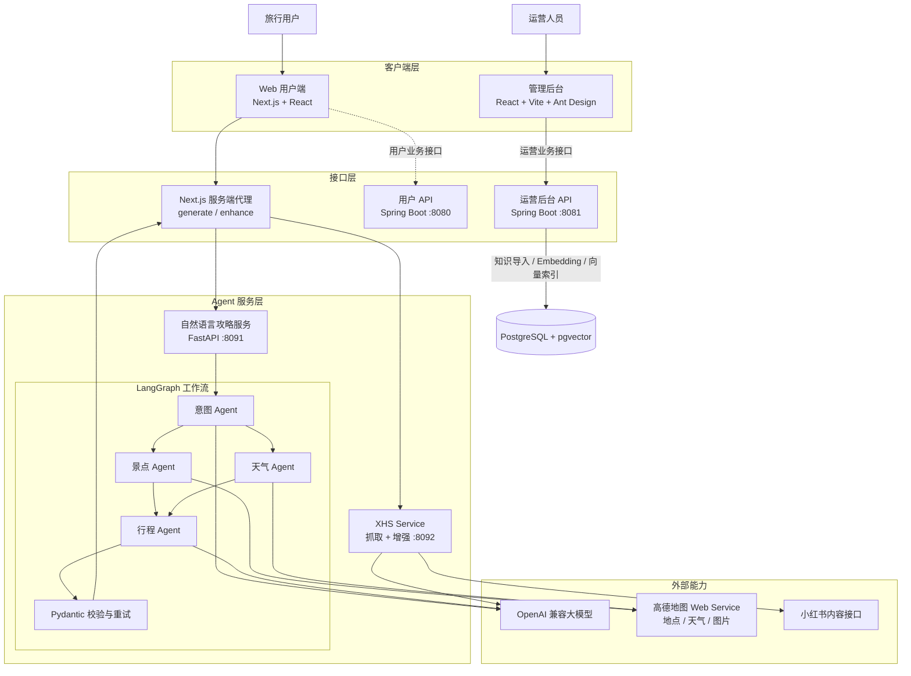
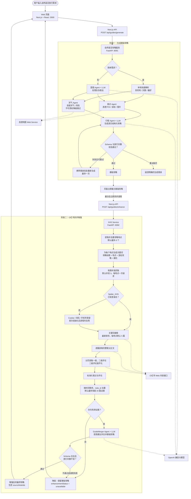
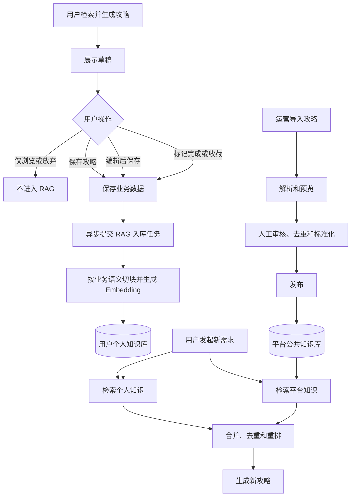
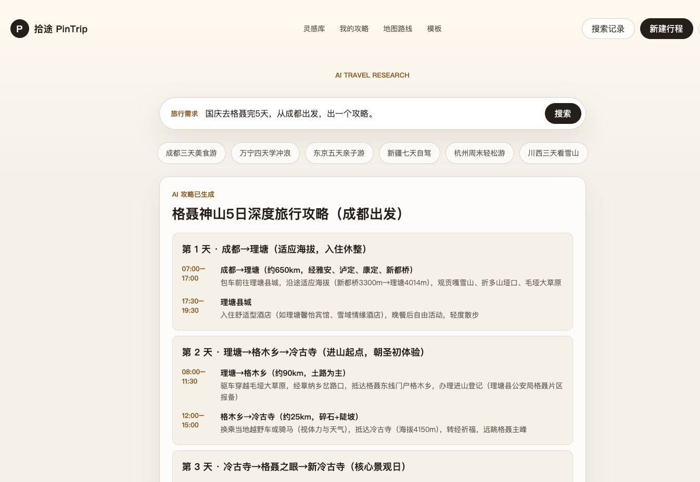
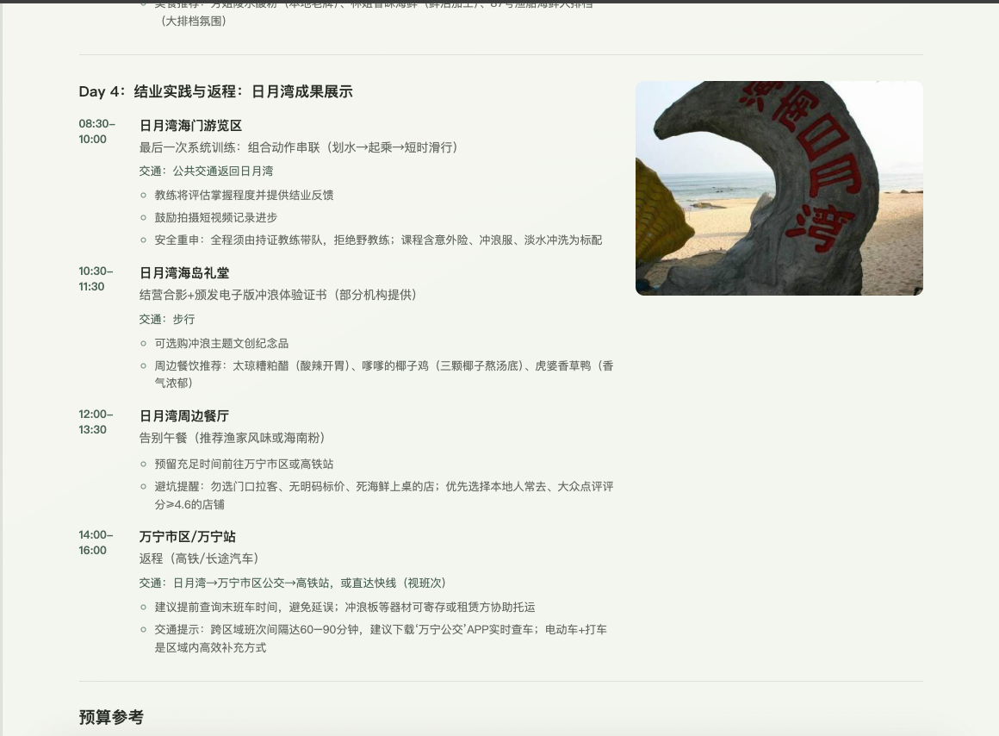
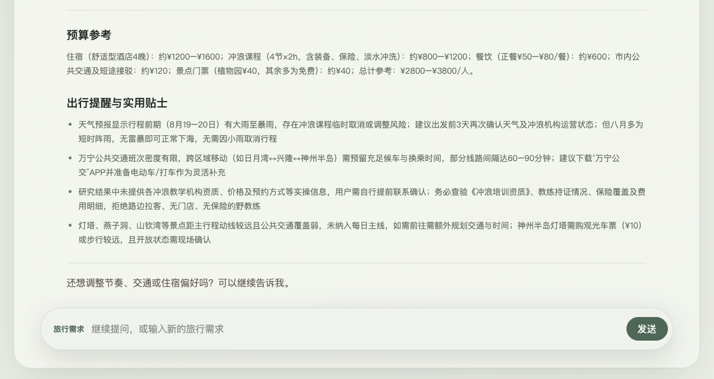
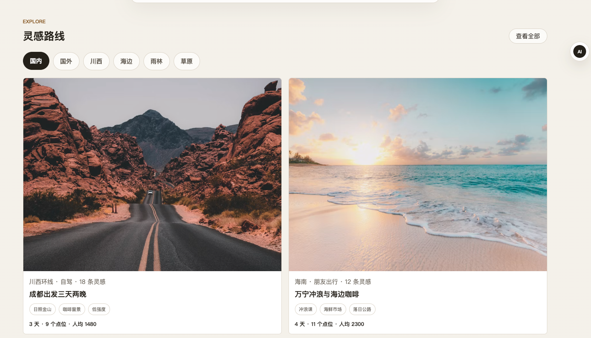

# PinTrip（拾途）

PinTrip 是一个 AI 旅行攻略生成平台。用户可以用自然语言描述目的地、旅行天数、交通方式和兴趣偏好，系统通过多 Agent 协作完成需求解析、景点与天气研究，并生成包含每日行程、预算和实景图片的结构化攻略。

项目同时包含面向 Web/App 的用户 Java API、运营后台 Java API、管理后台和多个职责独立的攻略 Agent，为后续扩展数据来源和攻略生成能力预留了清晰边界。

## 核心功能

### 自然语言生成攻略

- 支持输入“国庆去格聂玩 5 天，从成都出发”等自然语言需求。
- 意图 Agent 提取目的地、天数、交通、住宿、旅行偏好和额外约束。
- 未提供天数、交通或住宿时使用合理默认值。
- 结构化调用方可以直接传入目的地等字段，跳过意图 LLM。

### 多 Agent 协同研究

- 景点 Agent：调用高德地图检索真实地点、地址、坐标和实景图片。
- 天气 Agent：解析城市行政区编码并查询天气预报和旅行风险。
- 行程 Agent：综合用户需求、景点和天气信息，生成逐日攻略。
- LangGraph：管理共享状态、并行研究、结果汇合、校验和失败重试。

### 小红书真实笔记参考增强

- 基础攻略生成后，异步提取行程地点并调用 Spider_XHS 按关键词搜索相关笔记。
- 获取笔记标题、正文以及一级、二级评论，按发布时间倒序并通过 `note_id` 去重。
- GuideMerger Agent 从真实游客内容中提炼游玩建议、时间安排、本地体验和避坑信息，再合并回基础攻略。
- 增强结果记录 `sourceNoteIds`，前端展示参考笔记数量和增强状态。
- 抓取或增强服务不可用时自动保留基础攻略，不影响主流程；小红书图片不会写入攻略，页面图片继续使用高德返回的可信地址。
- 支持 Cookie、扫码和手机号三种登录方式；扫码或手机号会话在 XHS Service 进程内复用。

### 结构化攻略展示

- 按天展示时间、地点、活动和交通安排。
- 优先使用高德 POI 返回的真实图片作为每日封面，不编造图片地址。
- 输出标题、摘要、预算、风险提示和来源笔记 ID。
- 自动隐藏“数据缺失”“待生成”“警示版”等不适合展示给用户的占位内容。

## 整体系统架构



实线表示当前已经接通的主要调用链路，虚线表示已建立模块但尚未完成的业务集成。

## 两阶段攻略生成流程

当前 PinTrip 的主链路采用“两阶段生成”：先生成并展示基础攻略，再异步抓取小红书笔记与评论进行增强。第二阶段不可用时保留基础攻略，不阻断用户查看和使用。



阶段一中，景点研究和天气研究由 LangGraph 异步并行执行；简单的单目的地请求走本地快速解析，复杂表达才调用意图模型。基础攻略通过 Pydantic Schema 和旅行天数校验后立即展示。阶段二从攻略中提取地点，有限并发调用 Spider_XHS 获取笔记正文和评论，再由 GuideMerger Agent 合并有效证据。任何抓取、合并或增强校验失败都会降级为基础攻略。

## RAG 知识沉淀与复用流程

RAG 知识库分为用户个人知识和平台公共知识两个来源。AI 刚生成的草稿不会直接写入知识库；只有用户主动保存、编辑后保存、标记完成或收藏的攻略，才作为确认过的个人经验异步入库。平台公共攻略则由运营人员导入并经过解析、审核、去重和标准化后发布，避免未经验证的生成内容反复回灌并污染后续结果。



用户攻略入库采用稳定的 `guide_id` 标识攻略，并通过递增的 `revision` 更新已有向量数据。在线生成时，系统分别召回当前用户的历史攻略和已发布的平台攻略，再进行权限过滤、相关度筛选、去重与重排，最终将可靠证据交给行程 Agent。个人攻略自动入库和平台公共知识库属于逐步接入的业务链路，不影响 RAG 不可用时继续生成基础攻略。

## 系统运行效果

### 自然语言生成旅行攻略

用户输入目的地、旅行天数和出发地等自然语言需求后，系统调用 Agent 完成意图识别、目的地研究和行程生成。



### 每日行程明细

生成结果按天展示时间、地点、活动、交通方式和实景图片。



### 预算与出行提醒

攻略末尾汇总住宿、课程、餐饮和交通预算，并提供天气、预约及避坑提醒。



### 灵感路线浏览

首页提供不同旅行主题的灵感路线和行程卡片。



## 技术栈

| 模块 | 技术 |
| --- | --- |
| Web 用户端 | Next.js 15、React 19、TypeScript |
| 管理后台 | React 19、Vite、Ant Design |
| 用户/运营 Java API | Java 17+、Spring Boot 3.4、Springdoc OpenAPI |
| Agent 服务 | Python 3.11+、FastAPI、Pydantic |
| Agent 实现 | LangChain、LangGraph、OpenAI 兼容模型 |
| 地图能力 | 高德地图 Web Service API |
| Monorepo | pnpm Workspace、Turborepo |

## 项目目录

```text
PinTrip/
├── apps/
│   ├── web/                         # 用户端和 Agent 服务端代理
│   └── admin/                       # 运营管理后台
├── services/
│   ├── user-api/                    # Web/App 用户 Spring Boot API
│   ├── admin-api/                   # 运营后台 Spring Boot API
│   └── agent-apps/
│       ├── natural-language-guide/  # 自然语言生成基础攻略（LangGraph）
│       └── xhs-guide-enhancer/      # XHS Service：抓取、筛选与攻略增强（含 Spider_XHS）
├── packages/
│   └── tsconfig/                    # 共享 TypeScript 配置
├── assets/
│   └── readme/                      # README 运行截图
├── package.json                     # 根目录命令
├── pnpm-workspace.yaml              # pnpm 工作区配置
└── turbo.json                       # Turborepo 任务配置
```

自然语言 Agent 内部目录：

```text
services/agent-apps/natural-language-guide/app/
├── agents/
│   ├── intent/                      # 自然语言意图解析
│   ├── attraction/                  # 高德景点研究与图片整理
│   ├── weather/                     # 高德天气研究
│   └── itinerary/                   # 结构化行程生成
├── infrastructure/
│   └── amap_client.py               # 高德地图适配器
├── workflows/natural_language_guide/
│   ├── graph.py                     # LangGraph 节点和边
│   ├── nodes.py                     # 节点行为与重试路由
│   ├── state.py                     # 工作流共享状态
│   ├── dependencies.py              # Agent 依赖接口
│   └── parsing.py                   # 大模型 JSON 解析
├── config.py                        # 环境配置
├── factory.py                       # Agent 与工作流装配
├── main.py                          # FastAPI 接口
├── models.py                        # 请求、响应和行程模型
└── observability.py                 # 节点日志与耗时统计
```

## 本地运行

### 环境要求

- Node.js 20+
- pnpm 9.15+
- Python 3.11+
- Java 17+ 和 Maven 3.9+（启动用户或运营 Java API 时需要）

首次拉取项目时初始化固定版本的 Spider_XHS 子模块：

```bash
git submodule update --init --recursive
```

该子模块由 XHS Service 通过内部 provider 直接调用，具体安装与配置参见 `services/agent-apps/xhs-guide-enhancer/README.md`。

### 1. 安装前端依赖

```bash
pnpm install
```

### 2. 配置并启动自然语言 Agent

```bash
cd services/agent-apps/natural-language-guide
python3 -m venv .venv
.venv/bin/python -m pip install -e .
cp .env.example .env
```

编辑 `.env`：

```dotenv
AMAP_MAPS_API_KEY=你的高德Web服务Key
LLM_API_KEY=你的大模型Key
LLM_MODEL_ID=gpt-4o-mini
# 使用兼容 OpenAI 协议的模型服务时配置
LLM_BASE_URL=https://你的模型服务地址/v1
```

启动 Agent：

```bash
.venv/bin/python -m uvicorn app.main:app \
  --host 127.0.0.1 \
  --port 8091 \
  --reload
```

检查服务状态：

```bash
curl http://127.0.0.1:8091/health
```

### 3. 配置并启动 XHS Service（可选）

XHS Service 在单个 Python/FastAPI 进程中直接调用内置的 Spider_XHS 子模块，并完成笔记筛选和攻略增强。

```bash
cd services/agent-apps/xhs-guide-enhancer
python3 -m venv .venv
.venv/bin/pip install -e .
.venv/bin/pip install -r vendor/Spider_XHS/requirements.txt
npm ci --prefix vendor/Spider_XHS
cp .env.example .env
```

在 `.env` 中配置模型和登录方式：

```dotenv
LLM_API_KEY=你的大模型Key
LLM_MODEL_ID=gpt-4o-mini

# cookie / qrcode / phone
XHS_LOGIN_TYPE=qrcode

# 仅 cookie 模式需要，必须包含 a1 和 web_session
# XHS_COOKIES=你的完整Cookie
```

`qrcode` 和 `phone` 不要求预先配置 Cookie。首次抓取时，终端会提示扫码或输入手机号及短信验证码；登录会话在当前 XHS Service 进程内复用，服务重启后需要重新登录。

启动 XHS Service：

```bash
.venv/bin/python -m uvicorn app.main:app \
  --host 127.0.0.1 \
  --port 8092 \
  --reload
```

检查服务：

```bash
curl http://127.0.0.1:8092/health
```

更完整的安装、登录及抓取参数说明见 [`services/agent-apps/xhs-guide-enhancer/README.md`](services/agent-apps/xhs-guide-enhancer/README.md)。

### 4. 启动 Web 用户端

新开一个终端，在项目根目录执行：

```bash
pnpm dev:web
```

浏览器访问：<http://localhost:3000>

Web 服务端代理默认访问 `http://127.0.0.1:8091`。如需修改 Agent 地址：

```bash
cp apps/web/.env.example apps/web/.env.local
```

然后确认两个 Agent 地址：

```dotenv
NATURAL_LANGUAGE_GUIDE_AGENT_URL=http://127.0.0.1:8091
XHS_SERVICE_URL=http://127.0.0.1:8092
```

只启动自然语言 Agent 时仍可生成基础攻略；未启动小红书抓取与增强服务时，页面会自动保留基础攻略。

### 5. 启动其他模块（可选）

```bash
# Web/App 用户 API：http://localhost:8080
pnpm dev:user-api

# 运营后台 API：http://localhost:8081
pnpm dev:admin-api

# 管理后台：http://localhost:3001
pnpm dev:admin

```

### 运营后台账号登录

运营后台 API 使用 PostgreSQL 保存账号，并由 Spring Security 校验 BCrypt 密码、签发 Bearer JWT。后台业务数据和 RAG 共用同一个 PostgreSQL + pgvector 实例。

使用 Docker Compose 可以一次启动 PostgreSQL、Admin API 和 Admin Web：

```bash
cp infra/admin/.env.example infra/admin/.env
docker compose --env-file infra/admin/.env -f infra/admin/compose.yml up -d --build
```

首次创建数据库卷时，Compose 会自动执行 `infra/admin/schema.sql`。已有数据库卷升级后，需要手工重新执行一次：

```bash
docker compose -f infra/admin/compose.yml exec -T postgres \
  psql -U pintrip -d pintrip < infra/admin/schema.sql
```

复制 `infra/admin/create-first-admin.sql.example`，将其中的 `PASSWORD_BCRYPT_HASH` 替换为 BCrypt（cost 12）摘要后执行一次，以创建首个运营账号。后台地址为 <http://localhost:3001>，Admin API 地址为 <http://localhost:8081>。

Admin API 默认使用以下 PostgreSQL 连接；生产环境可通过环境变量覆盖：

```dotenv
ADMIN_DATABASE_URL=jdbc:postgresql://127.0.0.1:5433/pintrip
ADMIN_DATABASE_USERNAME=pintrip
ADMIN_DATABASE_PASSWORD=pintrip

```

运营知识的 Embedding 由 Admin API 进程内置的量化版 `bge-small-zh-v1.5`
在本地生成（512 维），无需 Embedding API Key，也无需另外启动模型服务。
首次 Maven 构建会下载模型依赖，之后随 Admin API 镜像一起部署。
Guide Service 通过 `EMBEDDING_SERVICE_URL` 调用该内部接口，因此入库和检索共用同一份模型，
不再向云端发送 Embedding 请求。生产环境需用相同的 `PINTRIP_INTERNAL_API_KEY`
配置 Admin API 和 Guide Service。

如果旧数据库已使用 1536 维向量，需执行一次迁移（旧向量会清空，知识正文保留）：

```bash
docker compose -f infra/admin/compose.yml exec -T postgres \
  psql -U pintrip -d pintrip < infra/admin/migrate-local-embedding-512.sql
```

启动 API 时只需提供数据库连接和 JWT 签名密钥：

```bash
ADMIN_JWT_SECRET='请替换为至少32字节的随机密钥' \
pnpm dev:admin-api
```

运营账号、BCrypt 密码摘要、账号状态和角色全部从 PostgreSQL 读取。连续输错密码 5 次后默认锁定 15 分钟；可用 `ADMIN_LOGIN_MAX_FAILURES` 和 `ADMIN_LOGIN_LOCK_DURATION` 调整。运营后台开发服务器通过 `/admin-api` 代理访问 Java API，登录令牌默认有效期为 8 小时。

## 主要接口

| 服务 | 方法与路径 | 说明 |
| --- | --- | --- |
| Web | `POST /api/guides/generate` | 校验自然语言需求并代理到 Agent |
| Web | `POST /api/guides/enhance` | 异步请求小红书真实笔记增强，失败时返回基础攻略 |
| 自然语言 Agent | `GET /health` | 检查模型和高德配置是否齐全 |
| 自然语言 Agent | `POST /agent/natural-language-guide/generate` | 生成结构化旅行攻略 |
| XHS Service | `GET /health` | 检查 Spider_XHS、登录方式和模型配置 |
| XHS Service | `POST /agent/xhs-guide/enhance` | 抓取真实笔记与评论并增强基础攻略 |
| 用户 API | `GET /api/health` | Web/App 用户服务健康检查 |
| 运营后台 API | `GET /api/admin/health` | 运营服务健康检查 |
| 运营后台 API | `GET /api/admin/knowledge` | 从 PostgreSQL 查询知识库 |
| 运营后台 API | `POST /api/admin/knowledge/preview` | 在 Java 内预览知识切块 |
| 运营后台 API | `POST /api/admin/knowledge` | 导入、向量化并写入 pgvector |

自然语言 Agent 请求示例：

```bash
curl -X POST http://127.0.0.1:8091/agent/natural-language-guide/generate \
  -H 'Content-Type: application/json' \
  -d '{
    "trip_id": "trip-demo-001",
    "prompt": "国庆去成都玩三天，公共交通，喜欢美食和人文，不要太累"
  }'
```

## 验证与测试

```bash
# 前端类型检查
pnpm typecheck

# 前端生产构建
pnpm build

# 自然语言 Agent 测试
services/agent-apps/natural-language-guide/.venv/bin/python \
  -m unittest discover \
  -s services/agent-apps/natural-language-guide/tests \
  -v

# Java API 测试
mvn -q -f services/user-api/pom.xml test
mvn -q -f services/admin-api/pom.xml test
```

## 当前完成情况

| 能力                                          | 状态 |
|-----------------------------------------------| --- |
| Web 自然语言输入与 Agent 代理                 | 已实现 |
| 意图、景点、天气、行程四 Agent 协作           | 已实现 |
| LangGraph 并行研究、校验和重试                | 已实现 |
| 高德真实地点、天气和每日图片                  | 已实现 |
| XHS Service 抓取、排序、筛选与攻略增强        | 已实现，Spider_XHS 已按固定版本作为 Submodule 引入 |
| Java Admin API 知识导入、切块与 pgvector 索引 | 已实现 |
| 管理后台知识库接口                            | 已实现 |
| 数据库存储、任务队列和用户鉴权                | 待实现 |
| 可标记的地图，进行路书、路线图建设         | 待实现 |

## 安全说明

- `.env` 和 `.env.local` 已加入 Git 忽略规则，请勿提交 API Key。
- Agent 日志记录任务 ID、节点名称和耗时，不记录完整 Prompt 或 API Key。
